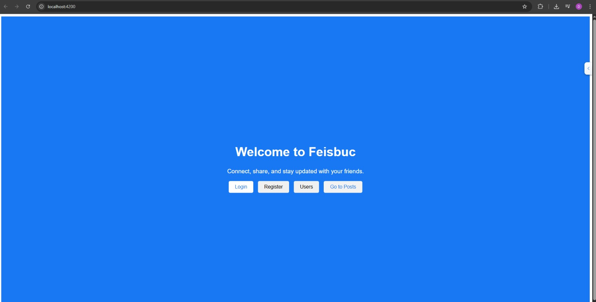
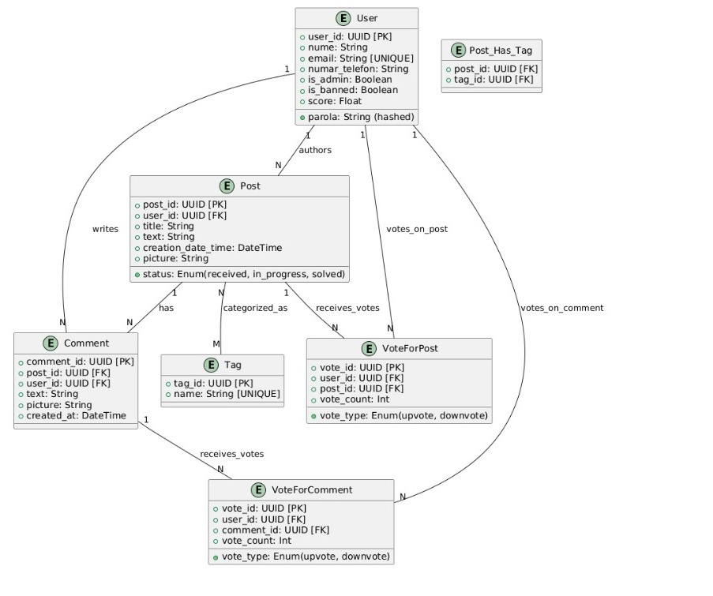

# FacebookProject

## Overview

FacebookProject is a full-stack web application that emulates core functionalities of Facebook, built with Angular and Java Spring Boot. It showcases modern web development practices, including component-based architecture, RESTful API design, and relational database management.

## Screenshots

## Demo

## Tech Stack

### Backend 🚀
- **Language & Framework:** Java, Spring Boot (Spring MVC, Spring Data JPA, Spring Security)
- **Database:** MySQL
- **Build Tool:** Maven

### Frontend 🎨
- **Framework & Language:** Angular, TypeScript
- **Styling & Structure:** HTML, CSS
- **Reactive Programming & HTTP:** RxJS, Angular Router, HttpClientModule

## Application Architecture

### DataBase diagram

### Backend (N-Layered - Java Spring Boot)
The backend employs an N-Layered architecture:
- **Controller Layer:** Handles HTTP requests and API endpoints.
- **Service Layer:** Contains core business logic.
- **Repository Layer:** Manages data persistence with PostgreSQL via Spring Data JPA.
- **Entity Layer:** Defines data models.
- **DTO Layer:** Facilitates data transfer.
- **Security Layer:** Implements JWT authentication and authorization.
- The backend, is organized into standard Maven project structure. Key packages include:
- `com.example.demo.controller`: API request handlers.
- `com.example.demo.service`: Business logic implementation.
- `com.example.demo.repository`: Database interaction interfaces.
- `com.example.demo.entity`: Database table mappings.
- `com.example.demo.dto`: Data Transfer Objects.
- `com.example.demo.security`: Security configurations.

### Frontend (Component-Based - Angular)
The frontend is built with Angular, utilizing a component-based architecture:
- **Modules & Components:** Reusable Angular modules and components.
- **Services:** Centralize frontend business logic and API communication.
- **Routing:** Angular Router manages navigation.
- **Route Guards:** Secure routes based on authentication status.
  The frontend, follows a typical Angular CLI project structure:
- `src/app/`: Contains the core application code, including:
    - **Component folders** (e.g., `login-page`, `main-page`, `posts-page`): Each holding component-specific files (`.ts`, `.html`, `.css`).
    - `service/`: Houses Angular services for various functionalities.
    - `app-routing.module.ts`: Defines application routes.
    - `app.module.ts`: The main application module.

## Core Features

- User Authentication: Secure registration and login.
- Profile Management: View and update user profiles.
- Content Creation: Create, view,  edit, and delete posts.
- Social Interactions: Comment on posts, like posts and comments.
- Friendship System: Send, accept, and manage friend requests.
- News Feed: Display relevant posts and updates.

## Roadmap

- Implement real-time notifications using WebSockets.
- Add support for groups and events.
- Enhance user profile customization options.
- Improve performance and scalability.
- Add more social features like messaging and media sharing.

